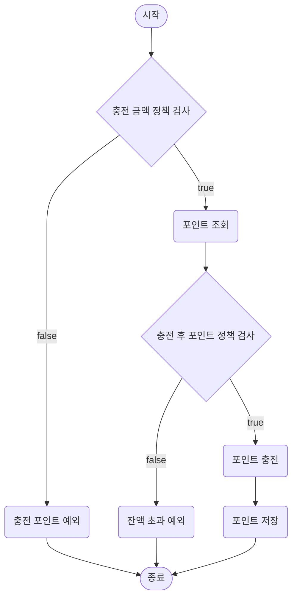
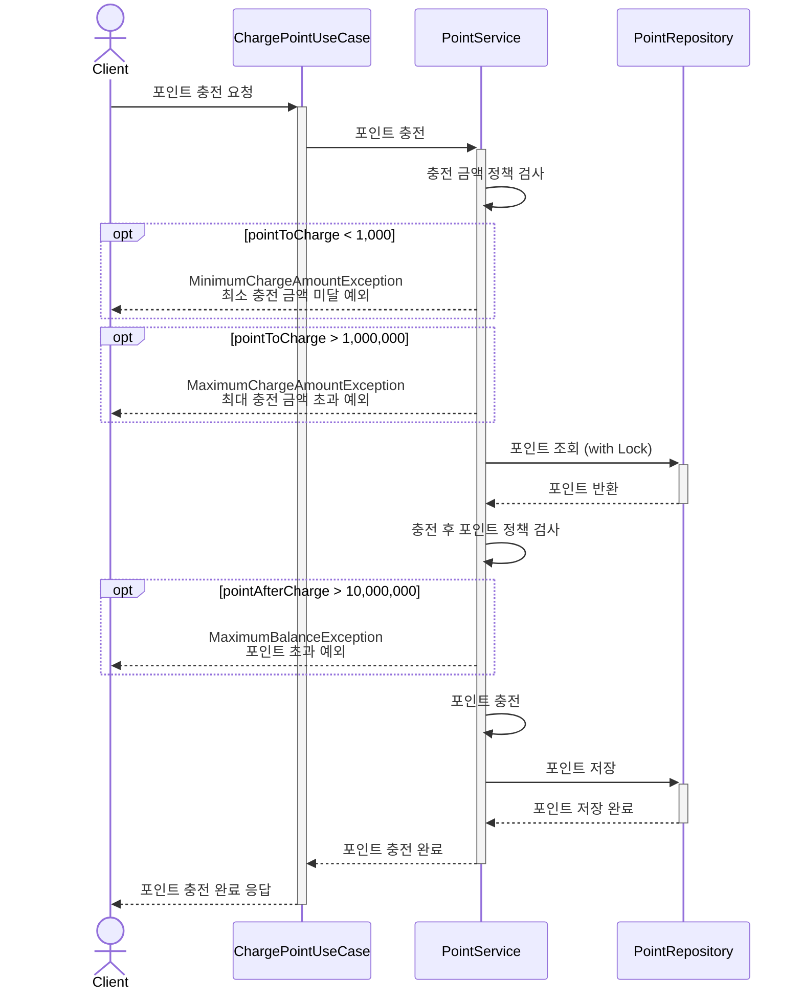
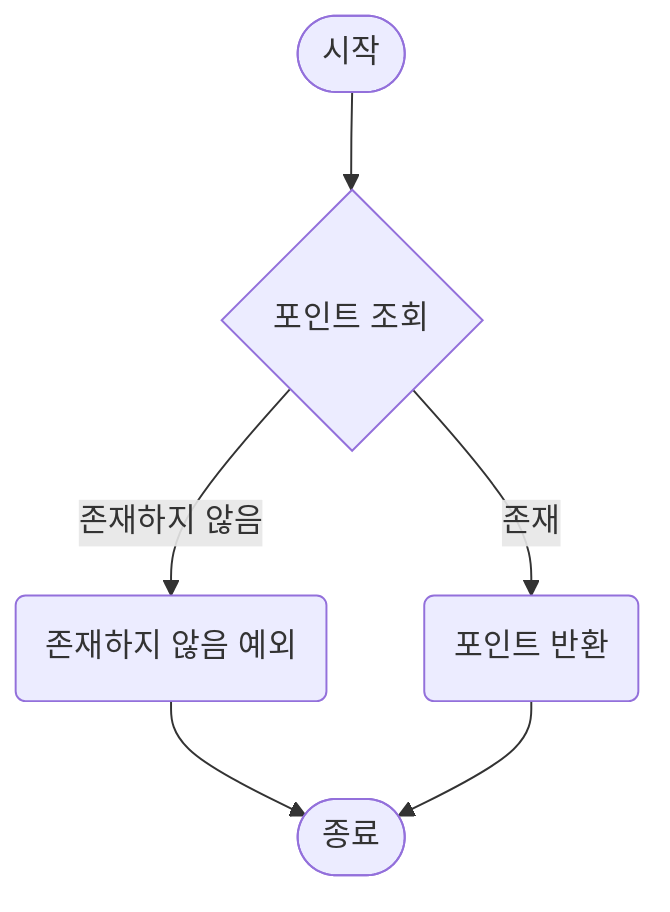
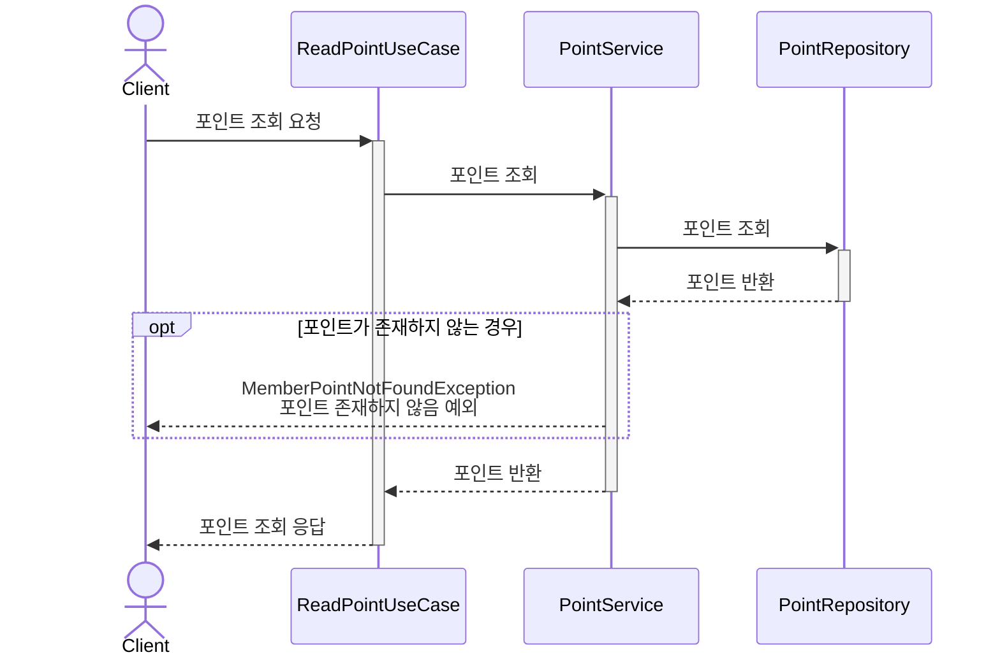

# 포인트 관리
포인트 충전 / 조회 API

## 포인트 충전 API

### 정책
- 1회 충전 금액
  - 최소: 1,000원
  - 최대: 1,000,000원
- 계정당 최대 보유 가능 금액
  - 10,000,000

### 시나리오
1. `Param` 사용자 ID, 충전 금액
2. 충전 금액이 정책을 만족하는지 검사 (1,000 <= 충전 금액 <= 1,000,000)
3. 충전 전 포인트 조회
4. 충전 후 포인트가 정책을 만족하는지 검사 (충전 후 포인트 <= 10,000,000)
5. 충전
6. DB 저장

### Flow Chart

### Sequence Diagram

## 포인트 조회 API

### 시나리오
1. `Param` 사용자 ID
2. 포인트 조회

### Flow Chart

### Sequence Diagram
