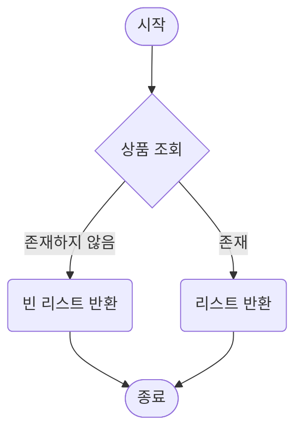
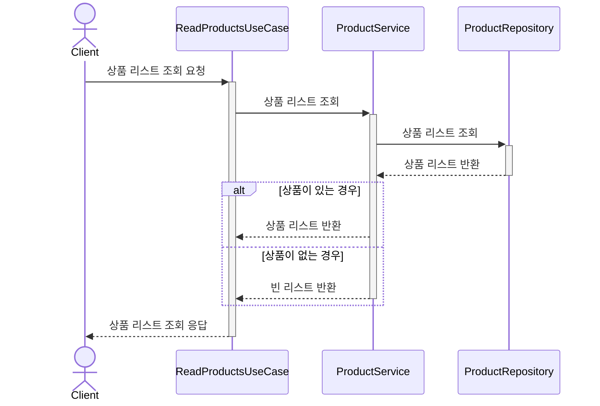

# 상품 정보 조회

## 상품 정보 조회 API

### 정책
- 조회 필터
    - 카테고리
- 조회 규칙
    - 일시 품절 상품: 조회 결과에 포함
    - 판매 중단 상품: 조회 결과에서 제외
- 정렬 규칙
    - 최신 등록 순
    - 가격순 (오름차순/내림차순)
- 사이즈
    - 페이지로 제공

### 시나리오
1. `Param` 카테고리 ID, 페이지, 페이지 사이즈, 정렬 기준
2. 상품 조회

### Flow Chart

### Sequence Diagram

