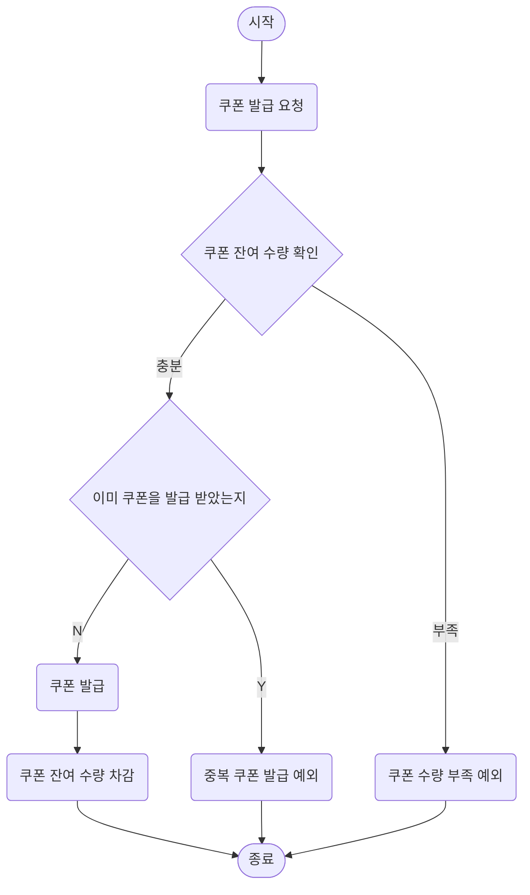
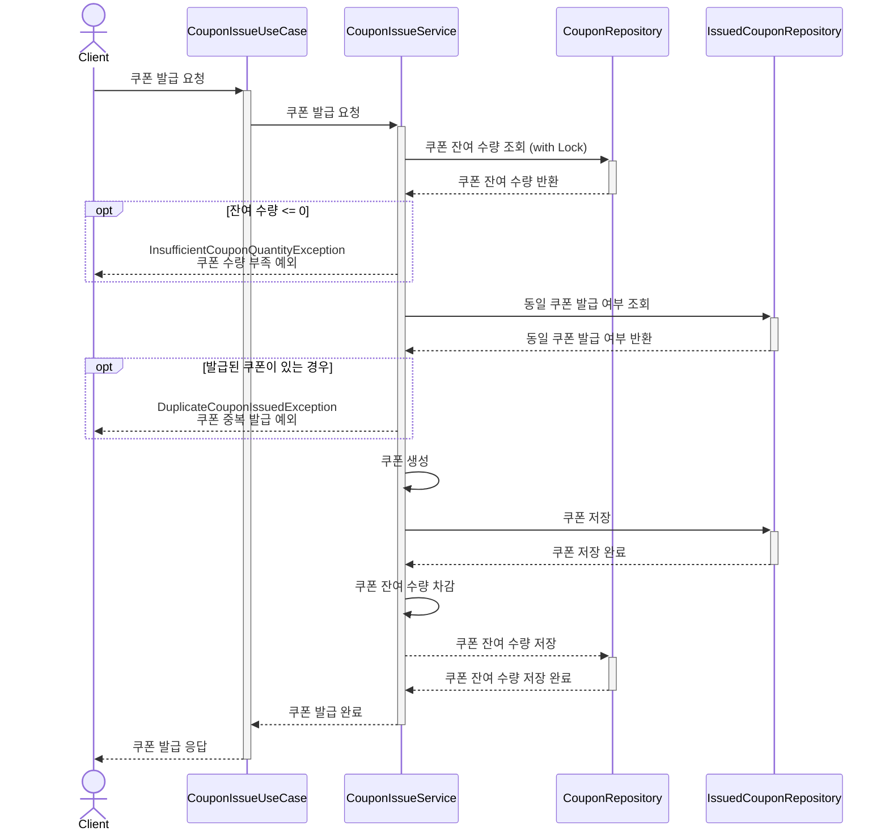
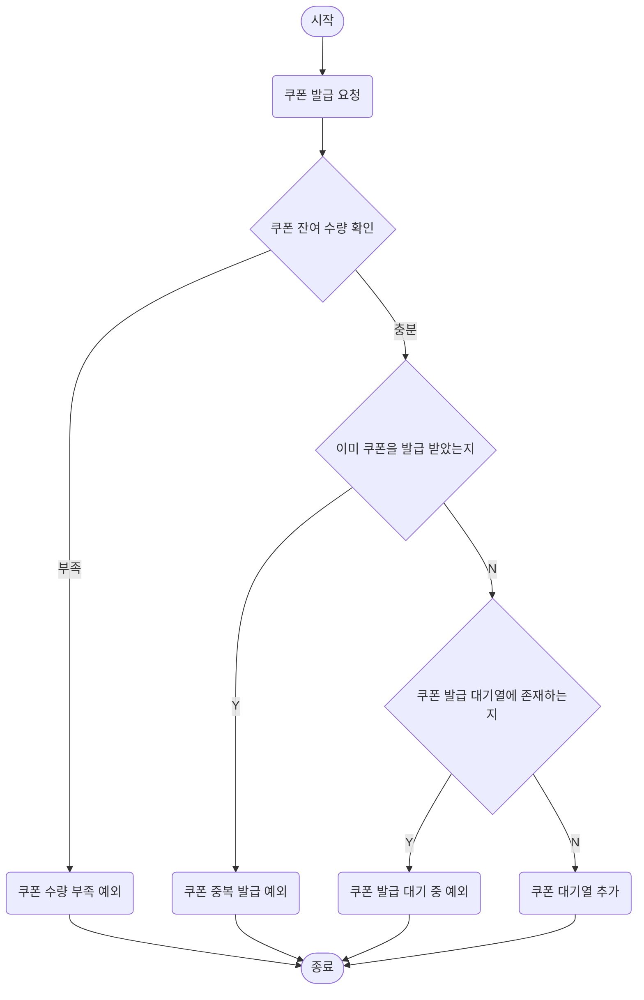
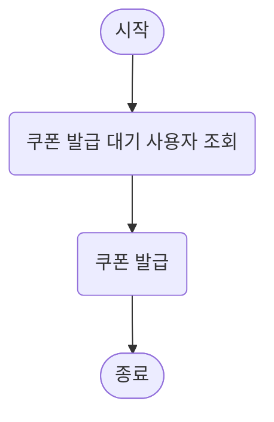
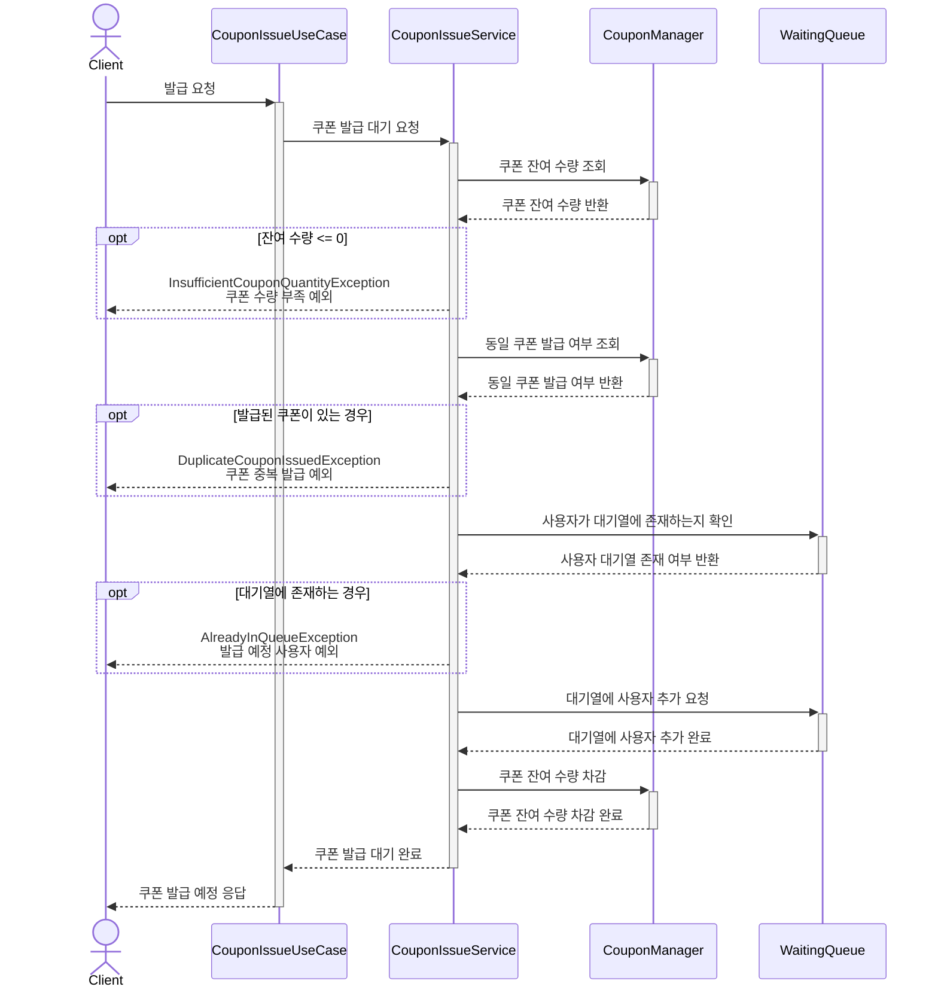
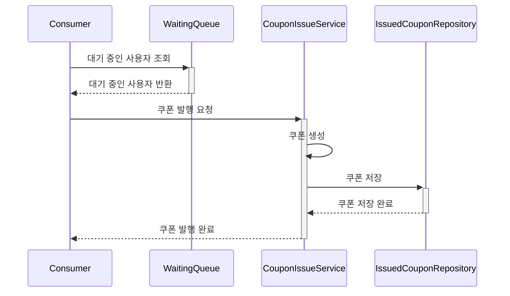

# 선착순 쿠폰
선착순 쿠폰은 정해진 수량 내에서 사용자의 요청 순서대로 쿠폰을 발급하는 기능입니다.
선착순 쿠폰 기능 구현에서 핵심적인 부분은 아래 두 가지입니다.

- 정해진 수량 만큼만 발급되어야 한다. (동시성 제어)
- 발급 요청을 보낸 순서대로 쿠폰 발급이 이루어져야 한다.

2가지 구현 방법으로 설계를 진행 했습니다.
1. 쿠폰 발급 요청 시, DB에 락을 걸어 동시성을 제어하는 방법. (이하 DB에 락을 사용하는 방법으로 지칭)
2. 쿠폰 발급 요청 시에는 사용자를 대기열에 추가하는 작업만 진행하고, 후에 대기열에서 사용자 정보를 꺼내서 쿠폰을 발급하는 방법. (이하 대기열을 사용하는 방법으로 지칭)

1번 방법은 DB 락을 사용하기 때문에 정합성 보장에 장점이 있으나 발급 요청을 보낸 순서대로 쿠폰을 발급하기에 어려움이 있고, 타 사용자의 트랜잭션이 커밋되기까지 대기해야 한다는 단점이 있습니다.

이를 보완하기 위한 2번 방법은 대기열을 통해 요청을 관리하므로 1번 방법에 비해 상대적으로 순서를 보장할 수 있고, 락을 걸고 수행하는 작업이 가벼워 동시성에 장점을 가질 수 있습니다. 
또한, Redis Lock 처럼 메모리에서 처리되는 Lock을 사용하면 성능에서도 강점을 가져갈 수 있습니다.

하지만, 추가적인 시스템 구축이 필요하기 때문에 규모를 고려하여 선택해야 합니다.  

### 정책

- 동일 쿠폰, 계정별 1매로 제한

## DB에 락을 사용하는 방법

### 시나리오
1. `Param` 사용자 ID, 쿠폰 ID
2. 쿠폰 잔여 수량 확인
3. 동일 쿠폰 발급 여부 확인
4. 쿠폰 발급
5. 쿠폰 잔여 수량 차감
6. 쿠폰 잔여 수량 저장

### Flow Chart

### Sequence Diagram

## 대기열을 사용하는 방법

### 시나리오

#### 쿠폰 발급 요청
1. `Param` 사용자 ID, 쿠폰 ID
2. 쿠폰 잔여 수량 확인
3. 동일 쿠폰 발급 여부 확인
4. 사용자가 쿠폰 대기열에 존재하는지 확인
5. 쿠폰 대기열에 사용자 추가
6. 쿠폰 잔여 수량 차감

#### 쿠폰 발급
1. 대기 중인 사용자 조회
2. 쿠폰 발급

### Flow Chart

#### 쿠폰 발급

#### 쿠폰 발급 요청

### Sequence Diagram

#### 쿠폰 발급 요청

#### 쿠폰 발급
