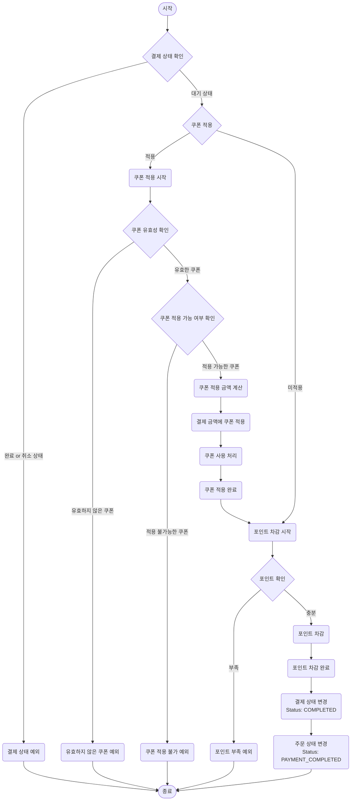
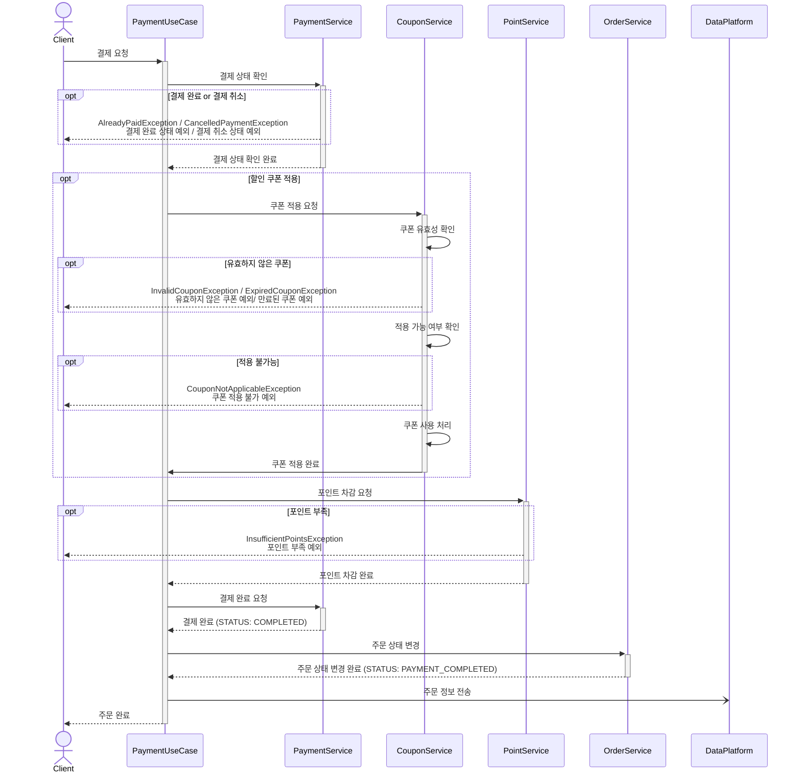

# 주문 및 결제

## 주문 API

### 시나리오
1. `Param` 사용자 ID, (상품 ID + 수량) 리스트, 배송 정보
2. 상품 재고가 충분한지 확인
3. 상품 재고 차감
4. 주문 생성 (결제 대기 상태)
5. 결제 생성 (대기 상태)

### Flow Chart

### Sequence Diagram

## 결제 API

### 정책
- 결제는 포인트로만 가능하다

### 시나리오
1. `Param` 사용자 ID, 주문 ID, 쿠폰 ID (optional) 
2. 결제 조회
3. 결제 상태 확인 (대기 상태인지)
4. 쿠폰 유효성 확인
5. 쿠폰 적용 가능 확인
6. 결제 금액에 쿠폰 할인 적용
7. 쿠폰 할인 처리
8. 포인트 조회
9. 포인트 충분한지 확인
10. 포인트 차감
11. 결제 상태 변경 (완료)
12. 주문 상태 변경 (결제 완료)

### Flow Chart

### Sequence Diagram
