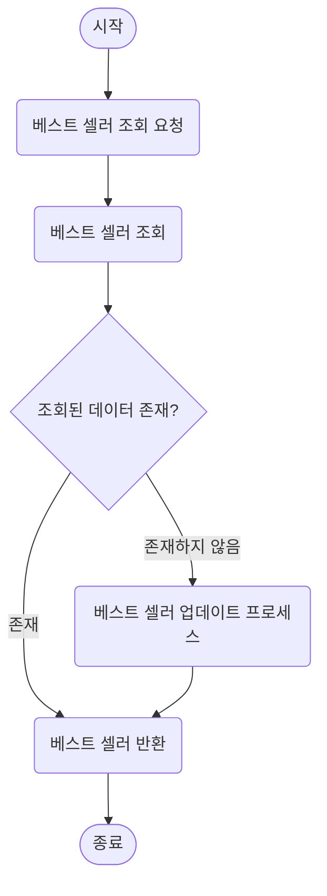

# 상위 상품 조회

상위 상품 집계를 위해 주문 완료 시에는 판매량 집계 테이블만 업데이트 하고, 일정한 간격으로 베스트 셀러 테이블(상위 상품 테이블)을 업데이트 하는 방법을 선택햇습니다.

해당 방법을 사용하면 실시간 베스트 셀러 상품을 확인할 수 없다는 단점이 있지만, 현재 요구사항에서는 3일간의 판매량을 기준으로 베스트셀러를 선정하기 때문에 실시간 업데이트가 큰 의미가 없다고 판단했습니다.

오히려 주문이 완료될 때마다 베스트 셀러 테이블을 업데이트하는 것은 불필요한 DB 부하를 발생시킬 수 있습니다.

따라서 주문 완료 시에는 판매량 집계 테이블만 업데이트하고, 배치 작업을 통해 주기적으로(예: 매일 새벽) 베스트셀러를 갱신하는 것이 더 효율적이라 판단했습니다.

### 정책
- 집계 기준: 최근 3일간 판매량
- 제공 정보: 상위 5개 상품(베스트 셀러) 정보
- 상품 범위: 카테고리

### 시나리오

#### 집계 대상 데이터 수집
1. 주문 요청
2. 주문 처리
3. 주문 처리 완료 후 주문 완료 이벤트 발행
4. 이벤트 핸들러에서 해당 제품 판매량 조회
5. 제품 판매량 업데이트

#### 베스트 셀러 업데이트
1. 1일마다 베스트 셀러 업데이트 스케줄 실행
2. 카테고리별 상위 판매 제품 조회
3. 베스트 셀러 업데이트

#### 베스트 셀러 조회
1. 베스트 셀러 조회
2. 조회된 데이터가 없다면
3. 베스트 셀러 업데이트 프로세스 실행 후 재조회

### Flow Chart

#### 집계 대상 데이터 수집

#### 베스트 셀러 업데이트

#### 베스트 셀러 조회

### Sequence Diagram

#### 집계 대상 데이터 수집

#### 베스트 셀러 업데이트

#### 베스트 셀러 조회
