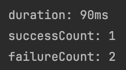
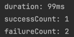
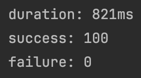
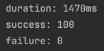
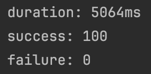
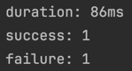
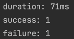
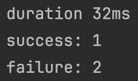

# 동시성 문제
### 경쟁 상태 (Race Condition)
- 두 개 이상의 프로세스나 스레드가 공유 자원에 동시에 접근하려 할 때 발생합니다.
- 실행 순서에 따라 결과가 달라질 수 있는 상황입니다.

### 데드락 (Dead Lock)
- 두 개 이상의 프로세스나 스레드가 서로 보유한 자원을 기다리며 무한히 대기하는 상태입니다.
- 발생 조건: 상호 배제, 점유와 대기, 비선점, 순환 대기

### 라이브락 (Live Lock)
- 프로세스들이 서로에게 양보하면서 계속 상태만 바꾸고 실제 작업은 진행되지 않는 상황입니다.
- 데드락과 비슷하지만, 프로세스들이 활성화된 상태로 계속 움직인다는 차이점이 있습니다.

### 기아 상태 (Starvation)
- 특정 프로세스가 필요한 자원을 계속해서 할당받지 못하는 상황입니다.
- 우선순위가 낮은 프로세스가 계속해서 자원 할당에서 밀려나는 경우를 의미합니다.

### 우선순위 역전 (Priority Inversion)
- 높은 우선순위 프로세스가 낮은 우선순위 프로세스가 들고 있는 자원을 기다리는 상황입니다.
- 시스템의 실시간성을 해칠 수 있는 심각한 문제입니다.

# DB 동시성 제어

## DB Lock

### 비관적 락 (Pessimistic Lock)

#### 동작 방식
- DB 수준에서 걸리는 물리적인 락으로 다른 트랜잭션이 특정 row나 table에 접근할 수 없도록 막습니다.
- 트랜잭션이 시작될 때 데이터에 대한 락을 명시적으로 요청, 다른 트랜잭션이 해당 데이터를 수정하지 못하도록 차단합니다.
- 주로 `SELECT FOR UPDATE` 구문이 사용됩니다.

#### 장점
- 강력한 데이터 정합성 보장합니다.
- 충돌이 자주 발생하는 환경에 효과적입니다.

#### 단점
- 동시성이 처리 성능이 저하됩니다.
- 데드락 발생 가능성이 있습니다.

#### 구현
```java 
@Lock(LockModeType.PESSIMISTIC_WRITE)
@Query("select c from Coupon c where c.id = :id")
Optional<Coupon> findByIdWithLock(@Param("id") Long id);
```
`@Lock(LockModeType.PESSIMISTIC_WRITE)` 어노테이션을 통해 락을 획득합니다.

트랜잭션이 완료(COMMIT / ROLLBACK)되면 락이 해제됩니다.

### 낙관적 락(Optimistic Lock)

#### 동작 방식
- 데이터에 버전 정보를 추가, 수정 시마다 버전을 증가시킵니다.
- 데이터를 읽을 때 버전 정보와 함께 읽고, 수정 시 현재 버전과 읽은 버전을 비교합니다.
- 버전이 다르면 충돌이 발생한 것으로, 즉시 실패를 반환합니다.

#### 장점
- 동시성 성능 우수합니다.
- 데드락 위험이 없습니다.

#### 단점
- 요구사항에 따라 충돌 시 재시도 로직 필요할 수 있습니다.
- 충돌이 빈번한 경우 성능 저하됩니다.
- 버전 정보를 관리해야 합니다.

#### 구현
```java
@Entity
public class Coupon {
    ...
    @Version
    private Long version;
}
```
엔티티에 `@Version` 어노테이션을 붙여 버전을 추가하면, 수정 시 버전을 확인하여 충돌 여부를 확인합니다.

##  분산 락 (Distributed Lock) with Redis

### Simple Lock

#### 동작 방식
- `SETNX` 명령어로 락 획득 시도합니다.
- 성공(1을 리턴)하는 경우, 작업 완료 후 `DEL` 명령어로 락을 해제합니다.
- 실패(0을 리턴)하는 경우, 즉시 실패를 반환합니다.

#### 장점
- 구현이 단순합니다.
- 단순 키-값만 확인하기 때문에 리소스 사용이 효율적입니다.
- 분산 시스템 적합합니다.

#### 단점
- 데드락 발생 가능성이 있습니다. (따라서, TTL 설정이 필요합니다.)

### Spin Lock

#### 동작 방식
- 락 획득을 시도합니다.
- 성공 시, 작업 완료 후 락을 해제합니다.
- 실패 시, 짧은 대기 후 재시도합니다. (최대 재시도 횟수나 타임아웃까지 반복합니다)

#### 장점
- 구현이 단순합니다.
- 대기 시간 조절 가능합니다. (백오프 전략)

#### 단점
- CPU 리소스가 과다 사용될 수 있습니다.
- 지속적인 네트워크 요청 발생할 수 있습니다.
- 재시도로 인한 시스템 부하가 생길 수 있습니다.

### Pub/Sub 기반

#### 동작 방식
- 락 획득을 시도
- 성공 시, 작업 완료 후 락을 해제하며 해제를 통지합니다.
- 실패 시, 채널 구독을 구독 후 락 해제 메시지 수신 대기합니다.

#### 장점
- 스핀 락에 비해 CPU 사용량이 적습니다.

#### 단점
- 타 방식에 비해 구현이 복잡합니다.
- 메시지 전달 지연 가능성이 있습니다.

# 프로젝트에서 발생 가능한 동시성 문제
프로젝트가 확장되어, 도메인별로 DB가 분리될 수 있다고 가정하고 진행했습니다.

## 1. 포인트 충전 및 사용

### 문제
포인트 충전 및 사용 시 잔액 불일치에 대한 문제가 발생할 수 있습니다.

### 방안
포인트 충전 및 사용에서는 충돌이 발생할 가능성이 적습니다.

동일한 사용자가 충전을 동시에 진행하거나, 사용을 동시에 진행하거나, 충전과 사용을 동시에 진행할 가능성이 떨어지기 때문입니다.

또한, 나열한 상황들은 정상적인 요청이 아닌 동일 요청이 중복해서 들어왔을 가능성이 높습니다.

따라서, 충돌이 적은 상황에 유리하면서 락을 획득하지 못하는 경우 즉시 실패를 반환하는 **낙관적 락** 방식과 **심플 락** 방식을 고려했습니다.

### 테스트
동일한 사용자의 충전 요청이 다수 발생하는 것은 일반적인 상황이 아니라 생각하여 3번의 요청으로만 테스트를 진행했습니다.

테스트 코드에서 로그로 실행 시간을 확인했을 때, 유의미한 차이는 없었습니다.




차례대로 낙관적 락, 심플 락을 사용한 경우입니다.

(테스트는 PointServiceIntegrationTest.PointConcurrencyTest 에서 진행했습니다.)

### 결론
테스트를 통해 유의미한 차이가 없음을 확인했고,
프로젝트가 확장되더라도 포인트 충전 및 사용의 경우에는 다른 도메인과 연관이 적기 때문에 현재 구현되어 있는 데로 **낙관적 락**을 유지하기로 했습니다.

## 2. 주문 시 재고를 초과한 판매

### 문제
상품 주문에서 재고에 대한 데이터 정합성 관리가 이루어지지 않으면 초과 판매가 발생할 수 있습니다.

### 방안
재고 데이터는 여러 사용자가 동시에 접근할 가능성이 높은 데이터 입니다.
특히, 인기가 있는 상품의 경우라면 충돌 가능성이 높습니다.

우선, 재고의 경우에는 정해진 수량 안에서는 여러 사용자가 구매할 수 있기 때문에 락을 획득하지 못하면 즉시 실패를 반환하는 낙관적 락과 심플 락 방식은 적합하지 않다고 판단하여 제외했습니다.

따라서, 최초 락 획득에 실패하더라도 대기 후 락을 획득할 수 있는 **비관적 락**, **스핀 락**, **Pub/Sub 기반의 Redisson 락** 방식을 고려했습니다.

### 테스트
인기 상품의 경우, 동일 상품에 대한 여러 사용자의 요청이 발생할 수 있다고 가정하여 100번의 요청으로 테스트를 진행했습니다.

테스트 코드에서 로그로 실행 시간을 확인했을 때, **비관적 락 < Redisson 분산 락 < 스핀 락** 순으로 실행 시간이 계산되었습니다.





차례대로 비관적 락, Redisson 분산 락, 스핀 락을 사용한 경우입니다.

(테스트는 OrderFacadeIntegrationTest.OrderConcurrencyTest 에서 진행했습니다.)

### 결론
테스트에서는 비관적 락이 가장 속도가 빨랐지만, 
주문 기능과 관련하여 여러 도메인이 얽혀있기 때문에 확장을 고려하여 DB 분리 시에도 안정적으로 동작할 수 있는 **Redisson 분산 락**을 채택했습니다.

## 3. 중복 결제
### 문제
동일한 주문에 대한 결제가 중복으로 발생할 수 있습니다.

### 방안
결제는 충돌 가능성이 높지는 않지만, 데이터 정합성이 중요하기 때문에 중복 결제가 발생하지 않도록 적절한 락을 사용해야 합니다.

기존에는 데이터 정합성을 위해 비관적 락으로 구현해놓았습니다.

데이터 정합성을 위한 **비관적 락**과 확장을 고려할 때 적합한 **분산 락**을 고민하였습니다.

### 테스트
동일한 결제에 대한 다수 요청이 들어오는 것은 일반적으로 가능성이 적은 상황이라 생각되어 3번의 요청으로 테스트 진행했습니다.

테스트 코드에서 로그로 실행 시간을 확인했을 때, 유의미한 차이는 없었습니다.




차례대로 비관적 락, 분산 락을 사용한 경우입니다.

(테스트는 PaymentFacadeIntegrationTest.PaymentConcurrencyTest 에서 진행했습니다.)

### 결론
결제 기능과 관련하여 여러 도메인이 얽혀있기 때문에 확장을 고려하여 DB 분리 시에도 안정적으로 동작할 수 있는 **Redisson 분산 락**을 채택했습니다.

(하지만, 현재 상황에서는 데이터 정합성을 높일 수 있는 **비관적 락**을 사용하는 것이 좋다고 생각이 됩니다.)

## 4. 쿠폰 중복 사용
### 문제
동일한 쿠폰을 중복으로 사용하는 문제가 발생할 수 있습니다.

### 방안
쿠폰 사용 또한 포인트 충전과 같이 충돌이 발생할 가능성이 적습니다.

하나의 쿠폰은 하나의 결제에만 사용되어야 하기 때문에 동시에 여러 사용 요청이 들어와도 1개의 요청만 성공해야 합니다.
즉, 이 외의 요청은 즉시 실패해야 합니다.

따라서, 충돌이 적은 상황에 유리하면서 락을 획득하지 못하는 경우 즉시 실패를 반환하는 **낙관적 락** 방식과 **심플 락** 방식을 고려했습니다.

### 테스트
쿠폰 사용 또한 동일한 쿠폰 사용에 대한 요청이 발생할 가능성이 적을 것으로 예상되어 3번의 요청으로 테스트를 진행했습니다.

테스트 코드에서 로그로 실행 시간을 확인했을 때, 유의미한 차이는 없었습니다.




차례대로 낙관적 락, 심플 락을 사용한 경우입니다.

(테스트는 CouponIntegrationTest.UseCouponConcurrencyTest 에서 진행했습니다.)

### 결론
테스트를 통해 유의미한 차이가 없음을 확인했고,
프로젝트가 확장되더라도 쿠폰 사용의 경우에는 다른 도메인과 연관이 적기 때문에 **낙관적 락**을 채택했습니다.

## 5. 선착순 쿠폰 초과 발급
### 문제
선착순 쿠폰을 정해진 수량보다 초과해서 발급하는 문제가 발생할 수 있습니다.

### 방안
선착순 쿠폰은 재고와 마찬가지로 여러 사용자가 동시에 접근할 가능성이 높습니다.

또한, 정해진 수량 내에서 여러 사용자가 쿠폰을 발급 받을 수 있도록 해야하기 때문에 낙관적 락과 심플 락 방식은 적합하지 않다고 판단했습니다.

따라서, **비관적 락**, **스핀 락**, **Pub/Sub 기반의 Redisson 락** 방식을 고려했습니다.

### 테스트
100번의 요청으로 테스트를 진행했습니다.

테스트 코드에서 로그로 실행 시간을 확인했을 때, **비관적 락 < Redisson 분산 락 < 스핀 락** 순으로 실행 시간이 계산되었습니다.


차례대로 비관적 락, 분산 락, 스핀 락을 사용한 경우입니다.

(테스트는 CouponIntegrationTest.IssuedCouponConcurrencyTest 에서 진행했습니다.)

### 결론
선착순 쿠폰의 경우에는 다른 도메인과 연관이 적기 때문에 가장 속도가 빠른 **비관적 락**을 유지하도록 했습니다.