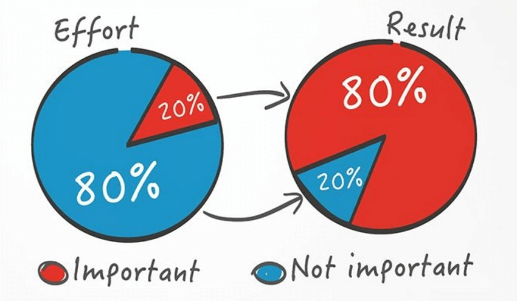
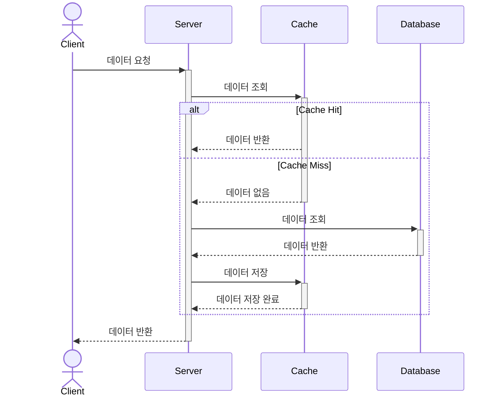
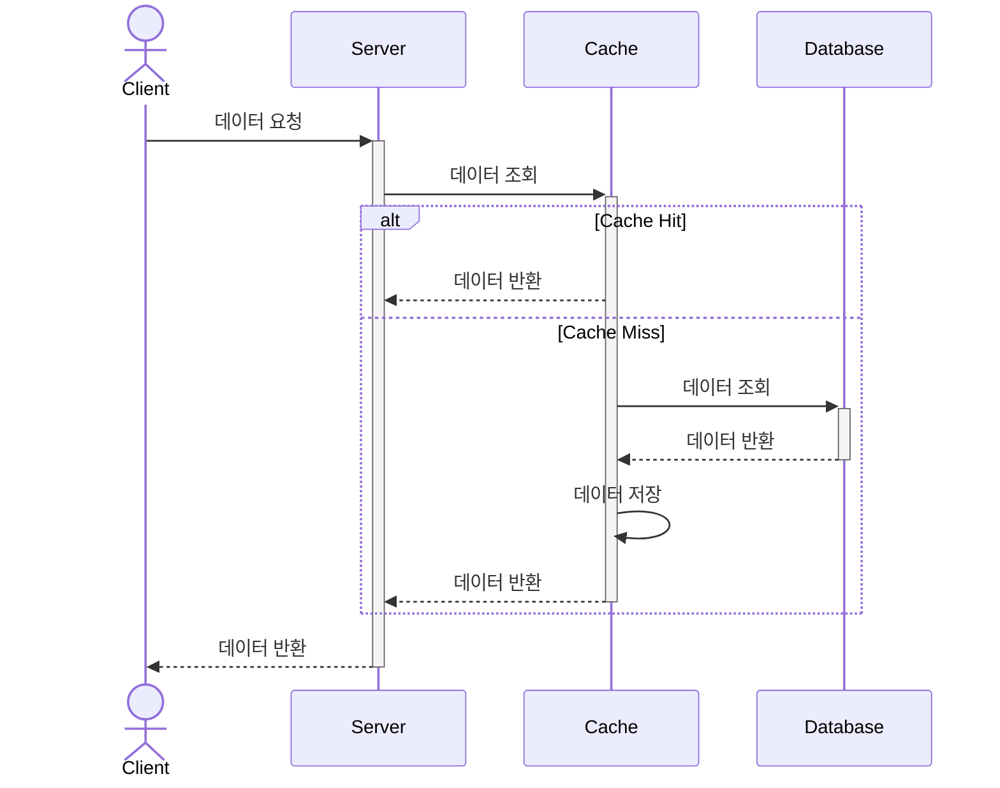
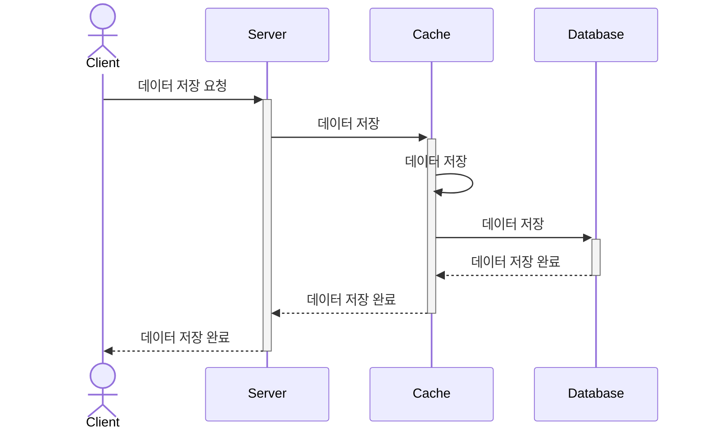
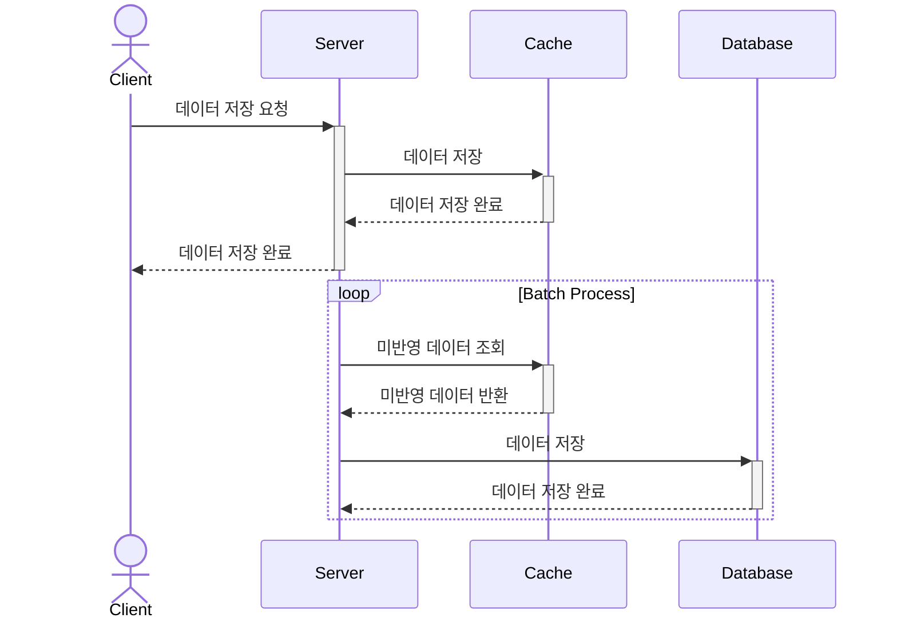
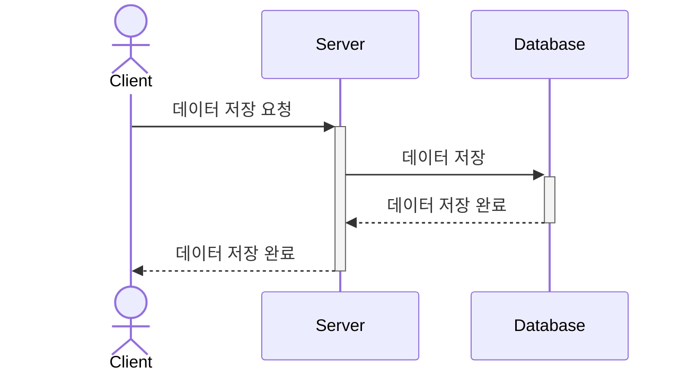
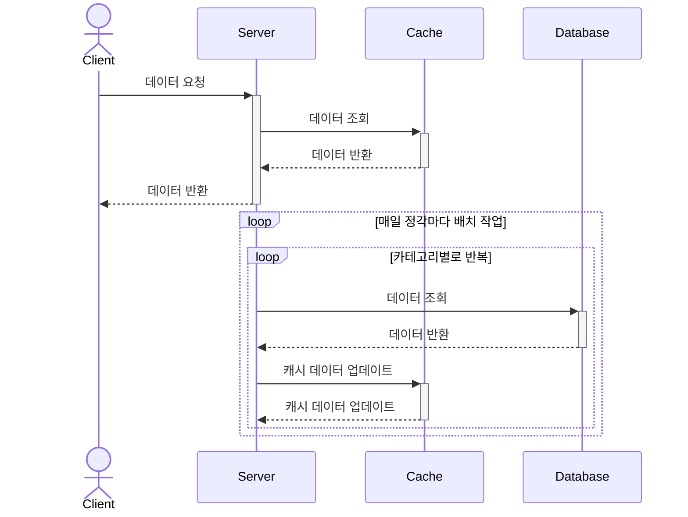

# 캐시란

데이터를 임시로 저장해두는 저장소로, 데이터에 대한 빠른 접근을 제공하여 전체 시스템의 성능을 향상시키는 것을 목적으로 합니다.

## 어떤 데이터가 적합할까

DB와 비교하여 캐시의 저장 공간은 비용이 상대적으로 높기 때문에 캐시 활용을 위해서는 적절한 데이터 선정이 매우 중요합니다.

1. 데이터 접근

   데이터의 접근 패턴을 고려해야 합니다.

   자주 조회되는 데이터를 우선적으로 캐시하면 캐시 히트율을 높일 수 있습니다.

   > **캐시와 파레토 법칙**
   > 
   >
   >
   > 캐시는 “전체 결과의 80%가 전체 원인의 20%에서 발생한다”는 파레토 법칙과도 연관이 있습니다.
   >
   > 전체 데이터 중 20%의 데이터가 전체 접근의 80%를 차지한다면, 이러한 20%의 데이터를 캐시에 저장하면 시스템 성능을 크게 향상 시킬 수 있습니다.
2. 데이터 생성 비용

   복잡한 쿼리나 무거운 비즈니스 로직을 통해 생선되는 데이터는 캐싱을 통해 큰 성능 향상을 얻을 수 있습니다.

   예를 들어, 여러 테이블을 조인하는 쿼리나 통계 데이터는 좋은 후보가 됩니다.

3. 데이터 변경 빈도

   자주 변경되는 데이터는 캐시 동기화 비용이 높아지므로 캐시 효율이 떨어지게 됩니다.

4. 데이터 크기

   캐시는 메모리 기반이므로 큰 용량의 데이터를 무분별하게 캐싱하면 메모리 부족 문제가 발생할 수 있습니다.

5. 데이터 일관성 요구사항

   실시간성이 중요한 금융 거래 데이터나 재고 수량과 같은 데이터는 캐시로 인한 불일치 문제가 발생할 수 있으므로 주의가 필요합니다.


# 위치에 따른 캐시

## 로컬 캐시

로컬 캐시는 애플리케이션의 개별 노드(서버 또는 인스턴스) 내에서 동작하는 캐시입니다. 즉, 각 애플리케이션 인스턴스가 자체적으로 데이터를 캐싱합니다.

대표적으로 ConcurrentHashMap, Caffeine, Ehcache를 사용할 수 있습니다.

### 장점

- **빠른 접근 속도**: 캐시 데이터가 애플리케이션 내부 메모리에 저장되므로 네트워크 오버헤드 없이 즉시 접근 가능.
- **단순한 구현**: 추가적인 인프라 없이 쉽게 적용 가능.
- **비용 절감**: 별도의 캐시 서버를 운영할 필요 없음.

### 단점

- **데이터 일관성 문제**: 여러 개의 애플리케이션 인스턴스가 있을 경우, 각 인스턴스의 캐시 데이터가 서로 다를 수 있음.
- **메모리 제한**: 각 애플리케이션의 메모리에 의존하므로, 대량의 데이터를 캐싱하기 어려움.
- **확장성 부족**: 서버가 여러 대로 확장될 경우, 동일한 데이터를 여러 인스턴스에서 캐싱해야 하므로 비효율적.

## 글로벌 캐시

글로벌 캐시는 모든 애플리케이션 노드가 공유하는 캐시 저장소입니다. 보통 별도의 캐시 서버(클러스터)를 두고, 여러 애플리케이션 인스턴스가 이를 참조합니다.

대표적으로 Redis, Memcached를 사용할 수 있습니다.

### 장점

- **데이터 일관성 유지**: 모든 애플리케이션이 동일한 캐시 데이터를 참조하므로 데이터 일관성이 보장됨.
- **확장성 우수**: 여러 애플리케이션 인스턴스가 동일한 캐시를 활용하므로, 확장이 용이함.
- **대량 데이터 캐싱 가능**: 캐시 서버의 리소스를 확장하면 더 많은 데이터를 저장 가능.

### 단점

- **네트워크 오버헤드**: 캐시 서버와 통신해야 하므로 네트워크 지연이 발생할 수 있음.
- **운영 비용 증가**: 별도의 캐시 서버(Redis, Memcached 등)를 운영해야 함.
- **단일 장애점(SPOF) 가능성**: 별도의 글로벌 캐시 서버가 장애를 일으키면 모든 애플리케이션 인스턴스에 영향을 줄 수 있음. 이를 방지하려면 캐시 서버를 클러스터링해야 함.

# 캐시 전략

캐시 전략에는 크게 읽기 전략과 쓰기 전략이 있습니다.

## 읽기 전략

### **Look Aside 전략**

**설명**

- 데이터 조회 시, 캐시를 먼저 조회합니다.
- 캐시에 데이터가 있는 경우(Cache Hit)
    - 캐시의 데이터를 반환합니다.
- 캐시에 데이터가 없는 경우(Cache Miss)
    - 데이터베이스를 조회합니다.
    - 조회된 데이터를 캐시에 저장 합니다.
    - 조회된 데이터를 반환합니다.




**장점**

- 애플리케이션이 캐시, DB 동작을 완전히 제어 가능합니다.
- 캐시 계층이 독립적이라 장애 시 DB로 직접 전환에 용이합니다.

**단점**

- 같은 키에 대한 동시 요청 시 중복 DB 조회 발생 가능합니다. (Cache Stampede)
- 애플리케이션에서 캐시 로직 관리가 필요합니다.

### **Read Through 전략**

Look Aside 전략과 진행되는 순서는 동일하나, Cache Miss시 DB를 조회하는 주체가 서버가 아닌 캐시라는 점에 차이가 있습니다.




**장점**

- DB 조회 주체가 캐시이기 때문에, 애플리케이션 로직을 단순화할 수 있습니다.

**단점**

- 캐시에서 장애가 발생하는 경우 SPOF가 될 수 있습니다. (fallback 로직이 필요합니다.)

## 쓰기 전략

### **Write Through**

**동작 방식**

- 데이터 저장 시, 캐시와 DB를 같이 업데이트합니다.




**장점**

- 캐시의 데이터가 최신 데이터로 유지되고, 데이터 일관성이 높습니다.

**단점**

- 모든 쓰기 작업에 대해서 캐시, DB에 각각 저장해야 하기 때문에 쓰기 시간이 늘어납니다.

**적합한 상황**

- 데이터 일관성이 중요
- 실시간 데이터 조회가 필요한 경우
- 데이터 유실 시 심각한 문제가 발생하는 경우

### **Write Back**

**동작 방식**

- 데이터 저장 시, 캐시에 먼저 저장 합니다.
- 캐시에 저장된 데이터를 일정 주기로 DB에 저장합니다.




**장점**

- 데이터 저장 시, 캐시에만 저장하기 때문에 쓰기 성능이 좋고 DB에 부하가 감소합니다.

**단점**

- 시스템 장애 시 데이터 유실 가능성이 있습니다.
- 데이터 일관성 보장이 어렵습니다.

**적합한 경우**

- 대량의 쓰기 작업이 발생하는 경우
- 실시간 데이터 동기화가 필수적이지 않은 경우
- 일시적인 데이터 유실이 허용되는 경우

### **Write Around**

- 데이터 저장 시, DB에만 저장합니다.




**장점**

- 자주 변경되는 데이터의 경우 캐시와 DB 간 동기화에 부담이 없습니다.
- 구현이 단순합니다.

**단점**

- 데이터 일관성 보장이 어렵습니다.

**적합한 경우**

- 데이터가 자주 업데이트 되는 경우
- 약간의 데이터 지연이 허용되는 경우

# 캐시와 관련된 기타 개념들

## Cache Stampede

캐시 스탬피드는 특정 데이터가 캐시에서 만료될 때, 동시에 여러 요청이 원본 데이터 저장소로 몰려 부하가 급증하는 현상입니다.

이 문제는 높은 트래픽을 처리하는 시스템에서 특히 심각하게 발생하며, 원본 데이터 저장소에 과부하가 걸려 성능이 저하되거나 다운될 수 있습니다.

### 발생 과정

1. **캐시 만료 발생:** 데이터가 캐시에서 삭제됨
2. **다중 요청 발생:** 다수의 클라이언트가 캐시에서 삭제된 데이터에 접근하려 함
3. **캐시 미스:** 캐시 만료로 모든 접근이 캐시 미스
4. **데이터베이스 부하 증가:** 모든 요청이 데이터베이스로 전달되어 과부하 발생
5. **응답 지연 및 서비스 장애**: DB 부하로 인해 응답 시간이 길어지고, 심하면 서비스 장애로 이어질 수 있음

### 발생 가능한 상황

캐시 스탬피드 현상이 발생하는 상황은 크게 두 가지로 나눌 수 있습니다.

1. **여러 캐시가 동일한 시간에 만료되는 경우**
2. **많은 요청이 집중되는 Hotkey가 만료되는 경우**

### 방지 및 해결 방안

- **캐시 만료 시간 분산**

  여러 캐시가 동일한 시간에 만료되어 발생하는 캐시 스탬피드 현상의 경우에는 원인이 “동일한 만료 시간”에 있기 때문에, 만료 시간을 모든 요청에 대해 동일하게 설정하지 않고 랜덤한 시간을 부여한다면 해결할 수 있습니다.

- **캐시 만료 전 리프레시**

  캐시가 만료되기 전에 미리 데이터를 갱신하여, 캐시가 만료되지 않도록 하는 방법으로도 캐시 스탬피드 현상을 방지할 수 있습니다.

  관련하여 캐시가 만료되기 전에 확률적으로 캐시를 갱신하는 방식인 **PER 알고리즘**을 고려해볼 수 있습니다.

- **원본 저장소 조회 로직에 Lock 사용**

  캐시 스탬피드 현상의 문제점은 원본 데이터 저장소에 부하가 걸리는 것 입니다. 분산 락 등을 사용하여, 원본 저장소에 접근하는 요청을 제어하는 방법으로 부하를 줄일 수 있습니다.


> **PER(Probabilistic Early Recomputation) 알고리즘**
>
>
> 캐시가 만료되기 전에 확률적으로 미리 데이터를 갱신하여 캐시 스탬피드를 방지하는 기법입니다. 캐시 만료 시점이 다가올 수록 갱신 확률을 증가시키는 방식으로 동작합니다.
>
> **장점**
>
> - 캐시 만료 시점에 집중되는 부하를 분산시킵니다.
> - 캐시가 완전히 만료되기 전에 갱신되므로 사용자 응답 시간이 개선됩니다.
> - 확률적 접근으로 여러 요청이 동시에 갱신을 시도하는 것을 방지할 수 있습니다.
> - API 호출 시점에 연산이 일어나므로, 호출되지 않는 데이터는 자연스럽게 만료됩니다.
>
> **단점**
>
> - 불필요한 캐시 갱신이 발생할 수 있습니다.
> - 확률 기반이므로 갱신 타이밍과 빈도가 일정하지 않습니다.
> - 트래픽이 급증하는 경우, 여러 요청이 동시에 갱신 시도를 할 수 있습니다.

## Cache Warming

애플리케이션이 실행되거나 캐시가 재시작될 때, 미리 중요한 데이터를 캐시에 로드하여 캐시 미스를 줄이고 성능을 최적화하는 전략입니다.

캐시가 초기화된 상태에서는 요청이 발생할 때마다 데이터베이스나 원본 저장소에서 데이터를 가져와야 하므로, 처음에는 캐시 적중률이 낮고 성능이 저하될 가능성이 큽니다. 이를 방지하기 위해 캐시를 사전에 채워두는 것이 캐시 워밍입니다.

# 프로젝트 적용

프로젝트에서 상위 판매 상품 조회 기능에 캐시를 적용했습니다. 그 이유는 다음과 같습니다.

1. 연산 복잡도: 타 조회 API 대비 복잡한 연산을 수행하여 캐싱을 통한 성능 개선 효과가 큽니다.
2. 데이터 특성: 3일 전 0시부터 현재 날짜 0시까지의 결제 데이터를 기준으로 계산되어, 동일 날짜 내 조회 시 결과가 동일합니다.
3. 높은 조회 빈도: 보통 메인 페이지와 카테고리 페이지에 노출되는 데이터로, 빈번한 조회가 예상됩니다.

## 1. 캐시 기능 추가

```java
public interface Cache<K, V> {
    void put(String cacheName, K key, V value, Long ttl, TimeUnit timeUnit);
    V get(String cacheName, K key);
}

public class RedisCache<K, V> implements Cache<K, V> {
    private final RedissonClient redissonClient;

    @Override
    public void put(String cacheName, K key, V value, Long ttl, TimeUnit timeUnit) {
        RMapCache<Object, Object> cache = redissonClient.getMapCache(cacheName);
        cache.put(key, value, ttl, timeUnit);
    }

    @Override
    public V get(String cacheName, K key) {
        RMapCache<K, V> cache = redissonClient.getMapCache(cacheName);
        return cache.get(key);
    }
}
```

```java
public class CacheProvider<K, V> {
    private final Cache<K, V> cache;

    public V withCache(String cacheName, K key, Supplier<V> supplier) {
        V cachedValue = cache.get(cacheName, key);
        if (cachedValue != null) {
            return cachedValue;
        }

        V value = supplier.get();
        if (value != null) {
            cache.put(cacheName, key, value, ttl, TimeUnit.MILLISECONDS);
        }

        return value;
    }
}
```

`CacheProvider`는 메서드 실행 전 캐시에서 값을 확인하고, 캐시에 값이 존재하는 경우 값을 바로 반환해주는 역할을 하는 `withCache()` 메서드를 제공합니다.

Spring Cache에서 제공하는 `@Cacheable` 어노테이션과 동일한 역할을 수행하지만, TTL을 동적으로 입력할 수 있다는 차이점이 있습니다.

```java
public class ProductService {

    @Transactional(readOnly = true)
    public List<ProductResult> getBestSellingProductsWithCache(Long categoryId) {
        return cacheProvider.withCache("bestSellers", categoryId, getMillisecondsUntilMidnight(), () -> {
			      List<Product> products = productRepository.findBestSellingProductsByCategory(categoryId, SALES_PERIOD_DAYS, BEST_SELLING_LIMIT);
            return products.stream().map(ProductResult::from).toList();
        });
    }
    
    private long getMillisecondsUntilMidnight() {
        LocalDateTime midnight = LocalDateTime.now().plusDays(1).withHour(0).withMinute(0).withSecond(0).withNano(0);
        return Duration.between(LocalDateTime.now(), midnight).toMillis();
    }
    
}
```

`ProductService`에서 자정까지의 시간을 계산해 TTL로 설정합니다.

## 2. 캐시 스탬피드 현상 방지

### 여러 캐시가 동시에 만료되는 경우 - TTL 지터(Jitter) 적용

모든 캐시의 TTL을 익일 0시로 설정하면, 같은 시간에 모든 캐시가 만료되기 때문에 캐시 스탬피드 현상이 발생할 가능성이 높습니다. 이 경우 랜덤한 TTL을 설정함으로써 방지할 수 있습니다.

```java
public class CacheProvider<K, V> {
    private static final int MAX_TTL_JITTER = TimeUnit.MINUTES.toMillis(30);

    private final Cache<K, V> cache;

    public V withCache(String cacheName, K key, Long ttl, Supplier<V> supplier) {
        V cachedValue = customCache.get(cacheName, key);
        if (cachedValue != null) {
            return cachedValue;
        }

        V value = supplier.get();
        if (value != null) {
            customCache.put(cacheName, key, value, getRandomizedTTL(ttl), TimeUnit.MILLISECONDS);
        }

        return value;
    }
    
    private long getRandomizedTTL(Long baseTtl) {
		    return baseTtl + random.nextLong(0, MAX_TTL_JITTER + 1);
    }
}
```

`getRandomizedTTL()` 메서드를 추가하여 랜덤한 TTL을 설정할 수 있도록 했습니다. 단, 캐시 만료 시간은 0시 이후여야 하므로 지터의 범위를 0 ~ 30분으로 설정하였습니다.

### 동일한 키에 대한 캐시 미스가 다수 발생하는 경우 - 분산 락 적용

높은 트래픽이 예상되는 데이터 특성상, 동일 키에 대한 동시 요청으로 인한 캐시 스탬피드 현상을 방지하기 위해 분산 락을 구현했습니다.

```java
public class ProductService {

    @Transactional(readOnly = true)
    public List<ProductResult> getBestSellingProductsWithCache(Long categoryId) {
        return cacheProvider.withCache("bestSellers", categoryId, getMillisecondsUntilMidnight(), TimeUnit.MILLISECONDS, () -> {
		        String lockKey = String.join(":", "bestSellers", categoryId.toString());
		        return distributedLockProvider.withLock(lockKey, () -> {
					      List<Product> products = productRepository.findBestSellingProductsByCategory(categoryId, SALES_PERIOD_DAYS, BEST_SELLING_LIMIT);
		            return products.stream().map(ProductResult::from).toList();
		        });
        });
    }
    
    private long getMillisecondsUntilMidnight() {
        LocalDateTime midnight = LocalDateTime.now().plusDays(1).withHour(0).withMinute(0).withSecond(0).withNano(0);
        return Duration.between(LocalDateTime.now(), midnight).toMillis();
    }
    
}
```

`distributedLockProvider.withLock()` 메서드는 분산 락을 적용하는 메서드로, 내부적으로 `RedissonLock`을 사용합니다.

## 3. 만료 대신 선제적 갱신으로 변경

기존 캐시 구현은 만료 시간 설정 후 만료된 시점 이후 첫 조회 시 캐시를 갱신하는 방식을 사용했습니다. 하지만 요구사항을 분석한 결과, 다음과 같은 이유로 만료 방식이 아닌 선제적 갱신 방식이 더 적합하다고 판단했습니다.

- 캐싱 대상 데이터는 빈번하게 요청되는 데이터로, 캐시에 지속적으로 유지되는 것이 성능상 이점이 있습니다.
- 데이터 갱신 시점이 매일 0시로 고정되어 있어, 해당 시점에 캐시를 선제적으로 갱신하면 불필요한 데이터베이스 접근을 최소화할 수 있습니다.

이러한 분석을 바탕으로, 매일 0시에 캐시를 만료시키는 대신 자동으로 갱신하는 방식으로 구현을 개선했습니다.



```java
public class BestSellerCacheScheduler {

    @Scheduled(cron = "0 0 0 * * *")
    public void refreshBestSellerCache() {
        Optional.ofNullable(cacheManager.getCache("bestSellers"))
                .ifPresent(cache -> {
                    List<Long> categoryIds = productService.getAllCategoryIds();
                    categoryIds.forEach(productService::refreshBestSellingProducts);
                });
    }
    
}
```

매일 자정에 `bestSellers` 캐시를 새로운 데이터로 갱신하는 스케줄러를 등록합니다.

```java

public class ProductService {

    @Transactional(readOnly = true)
    @CachePut(value = "bestSellers", key = "#categoryId")
    public List<ProductResult> refreshBestSellingProducts(Long categoryId) {
        List<Product> products = productRepository.findBestSellingProductsByCategory(categoryId, SALES_PERIOD_DAYS, BEST_SELLING_LIMIT);
		    return products.stream().map(ProductResult::from).toList();
    }
    
}

```

`@CachePut` 어노테이션을 사용하여 캐시 데이터를 갱신합니다.